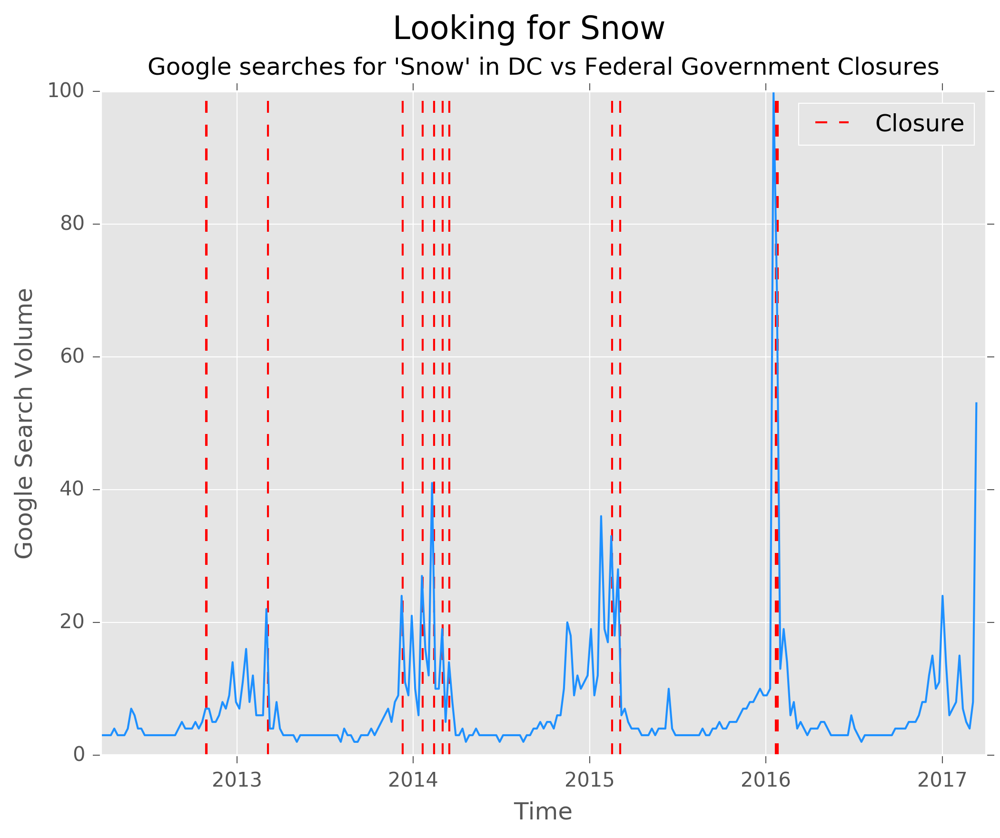

## Auditing the Feds: What Determines a Federal Government Snow Day?

### How behavioral Google search data and scientific weather forecast data play into the federal government’s snow day decision-making

## What's Here

The Office of Personnel Management within the federal government has the [almighty power](https://www.opm.gov/policy-data-oversight/snow-dismissal-procedures/current-status/) of declaring snow days. **Do they base this decision entirely on weather forecasts, or do they fall victim to the hype that surrounds possible snow days?**

To answer this question, I gathered every single snow day OPM has declared (see below). I also used the Dark Sky API to gather historical weather forecasts -- not historical *actual* weather, but what forecast was available to OPM at the time of their decision ([script](https://darksky.net/dev/) and [data](https://github.com/josephofiowa/zenzic/blob/master/federal-snow/forecasts.csv)). Finally, I downloaded the last five years of [Google Trends](https://trends.google.com/trends/explore?geo=US-DC&q=snow) search data for searches of "snow" within DC ([data](https://github.com/josephofiowa/zenzic/blob/master/federal-snow/google-trends-dc-snow.csv)).

I hope you enjoy the analysis that follows just as much as I did completing it. It's commented and everything is open source.

Keep up with the latest data science trends, cool analyses like this, and more via [Entropy](https://www.josephofiowa.com/entropy/).

### Medium Write-Up 

Read my [Medium post](https://medium.com/p/75a3432c613a/edit) describing my analysis.

### Data Collection

I collected data from three sources.

OPM data collected [via this](./fedsnow-scraper.py) and the data is [here](./opm_snow_data.csv)

Historical forecast collected via Dark Sky API. My script for doing so is [here](./forecast-data.py) and the data is [here](./forecasts.csv) Thanks to [@Zeevg](https://github.com/ZeevG/python-forecast.io) for the wrapper.

[Google Trends](https://trends.google.com/trends/explore?geo=US-DC&q=snow) data was downloaded via csv. It is [here](./google-trends-dc-snow.csv)

### Analysis

Analysis is in [this](./fed-closure-analysis.ipynb) Jupyter Notebook.

**I commented this relatively well, and I assured that the analysis is reproducible. Enjoy!**

