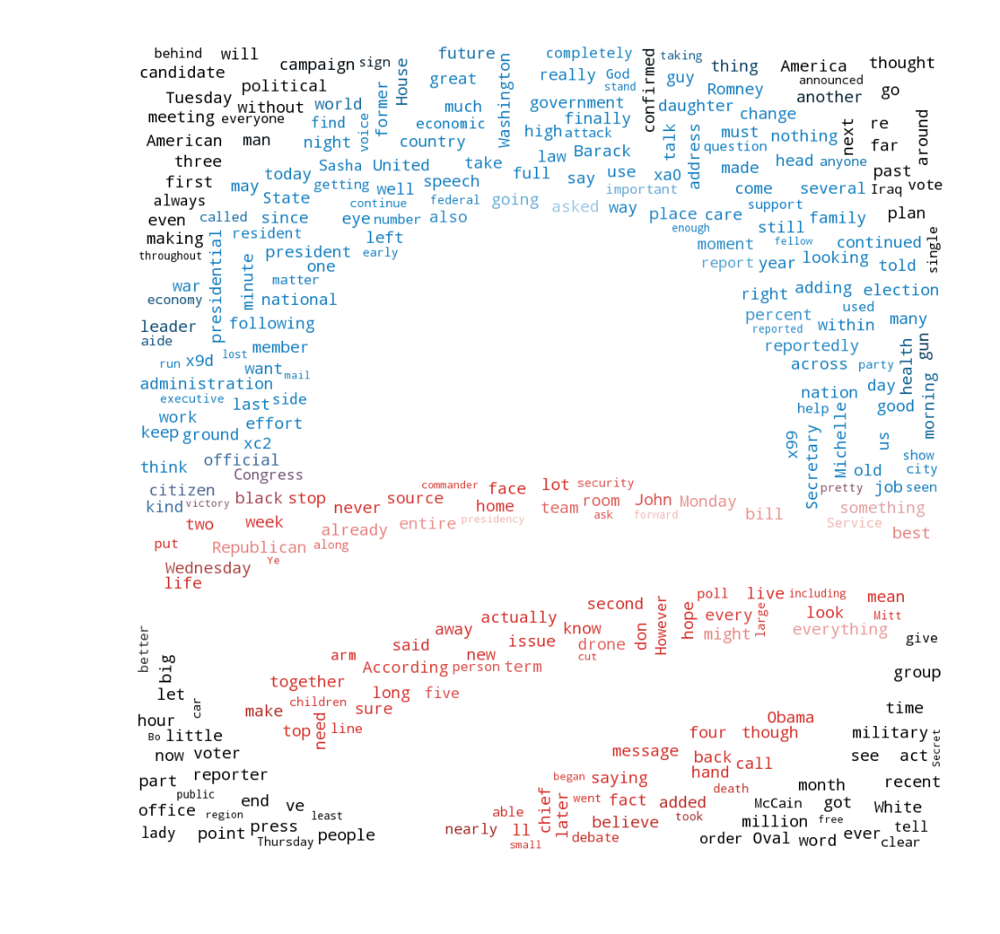

## Obama & The Onion

This repository houses the analysis I completed on every story The Onion wrote about Obama during his eight year presidency, gathered from their feature series [_Black Man Does Eight Years_](http://www.theonion.com/interactive/obama). 

Data collection methods are available [here](./obama-onion-scraper.py).

Analysis is in [this](./obama-onion-analysis.ipynb) Jupyter Notebook.

Wordart (yes, I'm rebranding WordArt from Microsoft Word) is available [here](./wordart/wordart.ipynb). That's because [wordclouds are not analysis](dataskeptic.com/blog/episodes/2016/kill-the-word-cloud). 

I commented this relatively well, and I assured that the analysis is reproducible. Enjoy!

